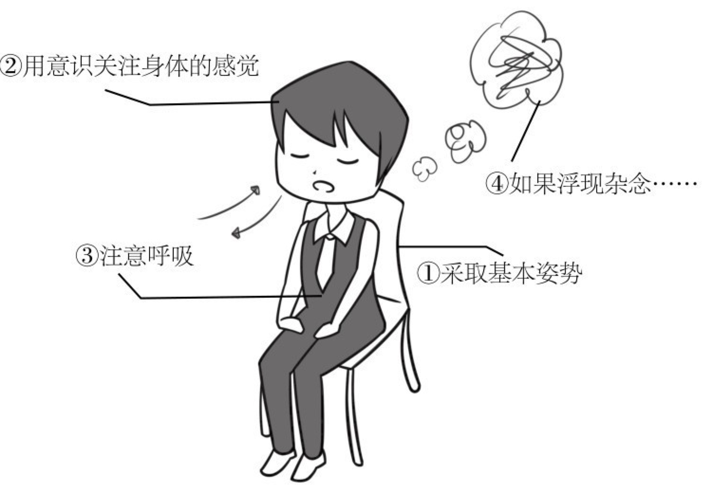
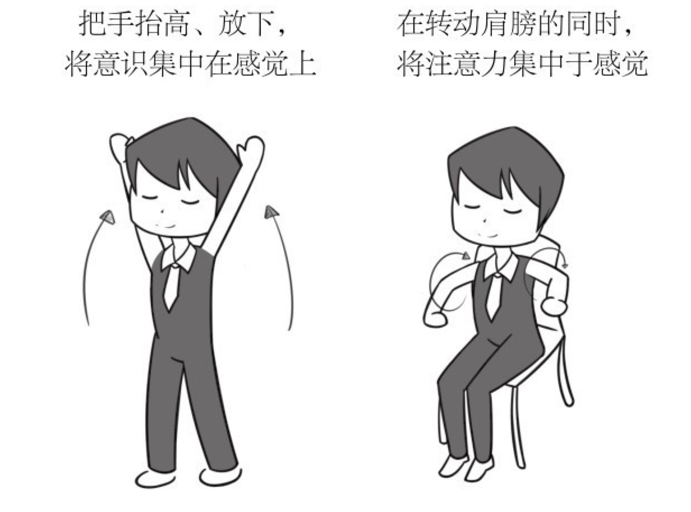
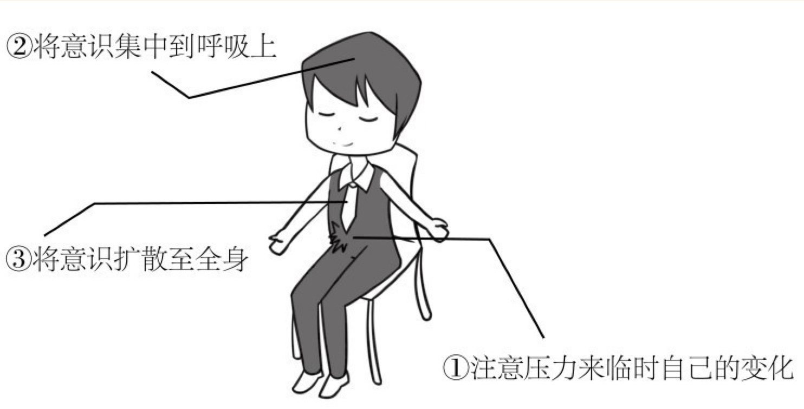
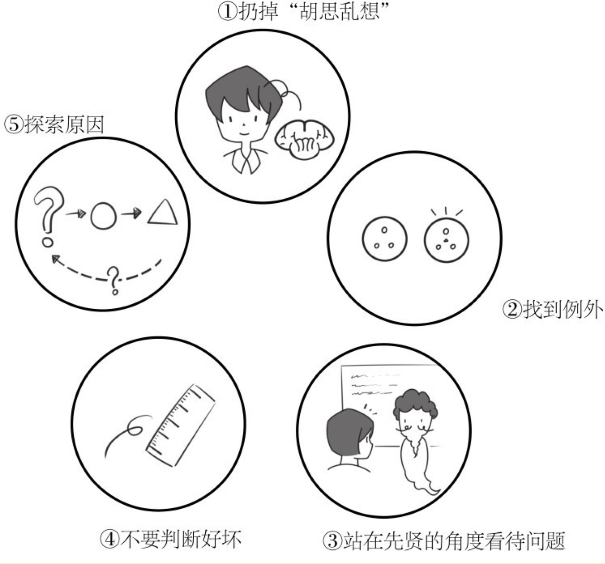
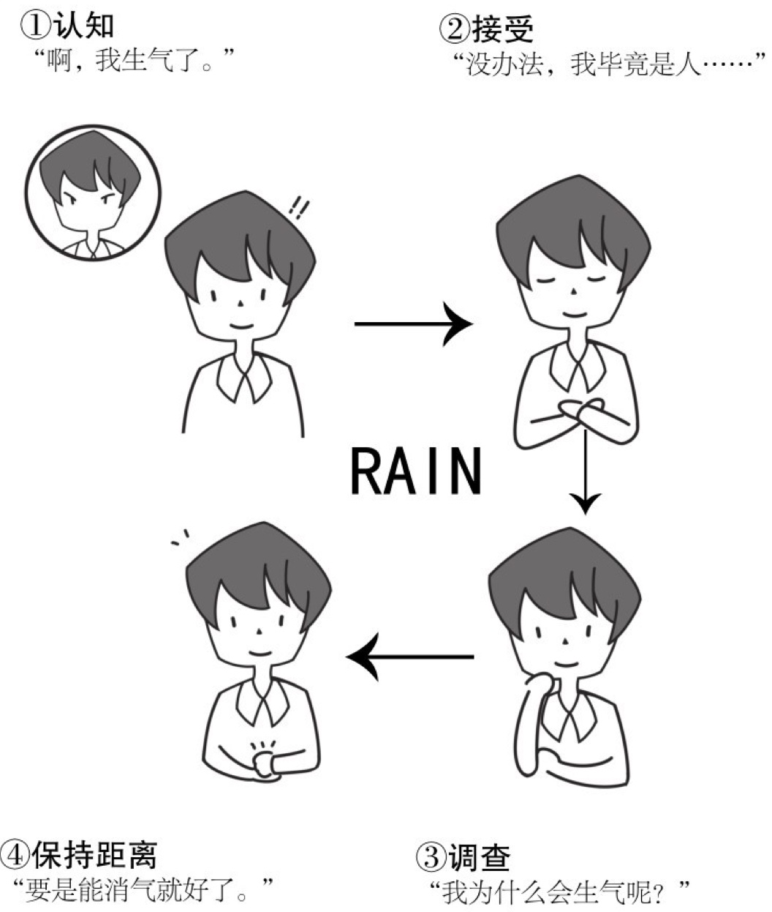
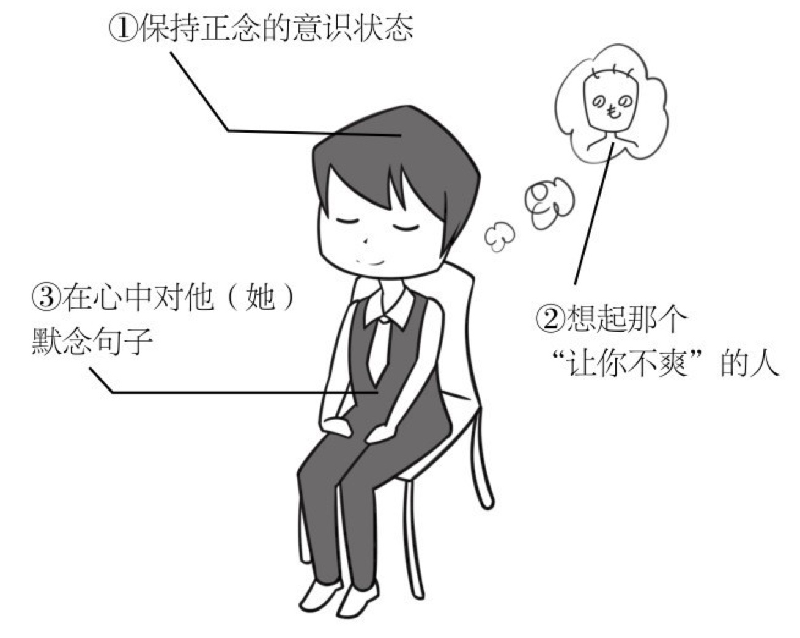
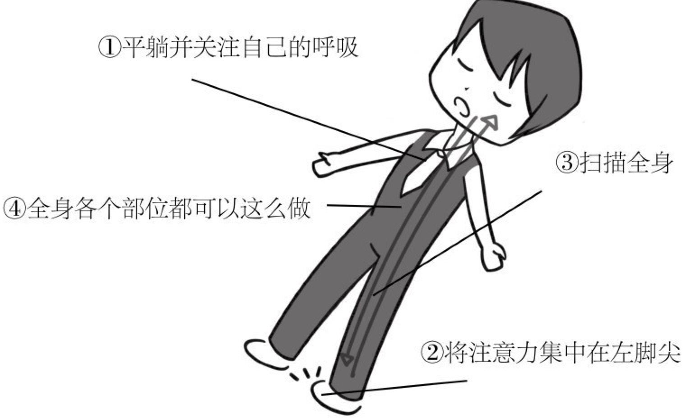

# 高效休息法


### 前言
1. 正念：通过冥想等方法促使大脑获取休息的总称，是科学正确的大脑休息法
2. 大脑具有可塑性，在人生的各个阶段都具有可塑性，不是只有童年时期才具有可塑性，只要改变，随时都可以
3. 人在大部分的时候所想和所做都是不一样的，大脑的想法层出不穷，要尽可能的减少大脑的各种想法

### 先睹为快！消除大脑疲惫的七个休息法
- 感觉脑袋昏昏沉沉时——正念呼吸法

```
对以下情况有效
1. 减轻压力，抑制杂念
2. 提高注意力和记忆力
3. 控制情绪
4. 改善免疫力

步骤
1. 采取基本姿势
    ·坐在椅子上，稍微挺直背部，离开椅背。
    ·腹部放松，手放在大腿上，双腿不交叉。
    ·闭上眼睛。如果采用睁着眼睛的方式，则双眼望向前方2米左右的位置。
2. 用意识关注身体的感觉
    ·感受与周围环境的接触（脚底与地板、屁股和椅子、手和大腿等）。
    ·感受身体被地球重力吸引。
3. 注意呼吸
    ·注意与呼吸有关的感觉（通过鼻孔的空气/因空气出入而导致胸部与腹部的起伏/呼吸与呼吸之间的停顿/每一次呼吸的深度/吸气与呼气的空气温度差异等）。
    ·不必深呼吸也不用控制呼吸，感觉就像是“等着”呼吸自然到来。
    ·为呼吸贴上“1”“2”……“10”的标签也很有效果。
4. 如果浮现杂念
    ·一旦发现自己浮现杂念，就将注意力重新放到呼吸上（呼吸是“意识的锚”）。
    ·产生杂念是很正常的，不必苛责自己。
5. 关键点
    ·5分钟也好，10分钟也好，重要的是每天持续实践。
    ·要在同一时间、同一地点进行（大脑最喜欢“习惯”）。
``` 

- 心事重重-动态冥想

```
对以下情况有效
1. 改善专注力和注意力
2. 实现心流状态

步骤
1. 步行冥想
    ·步行速度任意，但建议刚开始时走慢一点。
    ·有意识地留意手脚肌肉及关节的变化、与地面接触的感觉。
    ·给自己的动作分类，例如“左/右”“上/下”等（这样做能够进一步集中注意力）。
2. 以站姿进行动态冥想
    ·站着并将双脚打开至与肩等宽，伸出双臂，在身体两侧缓缓抬高。
    ·将注意力集中在腕部肌肉的变化、血液下流的感觉上，还要感受重力。
    ·慢慢将手臂抬高后，再慢慢放下手臂至原位，反复重复几次。
3. 以坐姿进行动态冥想
    ·坐在椅子上，从后向前慢慢转动肩膀。
    ·用心感受肌肉、关节的变化。
    ·转动一次后，反方向再次转动肩膀，以同样的方式集中注意力。
4. 其他方法
    ·有意识地关注日常生活中的动作，例如穿衣服、刷牙等。
    ·开车时可以关注屁股坐在椅子上的感觉、手握住方向盘的触感、控制方向盘以及刹车时肌肉和关节的变化等（注意安全驾驶）。
    ·一边做简单的体操，一边关注身体的变化。
5. 关键点
    ·提前决定好进行动态冥想的时机有助于养成习惯。例如，“今天决定从离开家门开始动态冥想”“刷卡进地铁站后开始动态冥想”等。
    ·吃饭时也可进行动态冥想。如关注食物的口感、食物在口腔内的触感、唾液的变化等。
```

- 压力导致身体状态不佳时——压力呼吸化法

```
对以下情况有效
1. 消除压力
2. 消除压力造成的紧张感（肩膀僵硬等）
3. 改善其他身体不适

步骤
1. 注意压力来临时自己的变化
    ·采取正念冥想的基本姿势。
    ·将造成压力的原因总结成“一句话”（这样做更易把握身体和内心的反应）。
    ·在心中默念这句话，同时感受身体和内心有何反应。
2. 将意识集中到呼吸上
    ·给呼吸贴上“1”“2”……“10”的标签。
    ·感受身体的紧绷慢慢舒缓、逐渐放松。
3. 将意识扩散至全身
    ·将注意力扩散至全身（设想全身都在“呼吸”）。
    ·吸入空气时，设想对压力有所反应的身体部位在“吸气”，随着呼吸起伏，有意识地保持该部位的放松。
    ·继续将注意力扩散至周围的空间。
4. 关键点
    ·身体疲劳的主要原因仍是大脑疲劳。
    ·将导致压力的原因“呼吸化”后，能够使自己的“认知扭曲”客观化。
```

- 想跳脱思考怪圈时——“猴子思维”消除法

```
对以下情况有效
1. 抑制某个想法的重复出现
2. 提高注意力，避免自我厌恶
3. 改善睡眠品质，容易进入深度睡眠

步骤
1. 扔掉“胡思乱想”
    ·给想法贴上标签，留心那些“想了很多遍”的事情。
    ·想象把那些已经“受够了”的想法踢出大脑的感觉。
2. 找到例外
    ·一直出现同样的想法，是不是因为设置了同一个前提？
    ·想想一直纠结的这个想法是否有反例。
3. 站在先贤的角度看待问题
    ·自己尊敬的人或历史上的伟人会怎么处理呢？
    ·他们是否会将“杂念本身”和“心怀杂念的自己”等同视之呢？
4. 不要判断好坏
    ·你是否用了不属于“当下”的其他标准来评判事物？
    ·要注意“不做道德评判（nonjudgmental）”。
5. 探索原因
    ·为什么这个想法会出现这么多次？（是因为愿望没被实现吗？）
    ·从自己的“深层需求（deepneeds）”开始重新思考。
6. 关键点
    ·要意识到“杂念=列车”而“自己=月台”，这种认知行为疗法的效果显著。
    ·思考的重复回环会妨碍睡眠（大脑的净化）。
```

- 被愤怒冲动冲昏头脑时——RAIN法

```
对以下情况有效
1. 平息怒气
2. 控制欲望，抑制冲动情绪
3. 减肥
4. 戒烟

步骤
1. Recognize（认知）
    ·认识到内心的愤怒。
    ·不把愤怒和愤怒的自己画上等号。
2. Accept（接受）
    ·接受自己愤怒的事实。
    ·对这个事实不加以价值评判，容许其存在。
3. Investigate（调查）
    ·观察一下愤怒时身体有何变化？
    ·心率变化如何？
    ·身体的哪个部位感到紧绷？
4. NonIdentification（保持距离）
    ·不要过分纠结自己的情绪。
    ·甩掉愤怒，把愤怒设想成是他人之事。
5. 关键点
    ·RAIN法对于控制愤怒之外的其他冲动情绪（渴望）也很有效。
    ·目标性越强的人越不容易放松心情，更容易情绪激动。
```

- 看他人不顺眼时——温柔的慈悲心

```
对以下情况有效
1. 抑制对他人的负面情绪
2. 培养正面情绪

步骤
1. 保持正念的意识状态
    ·将平常的正念冥想持续做10分钟。
    ·注意力从消极情绪重新集中到“当下”。
2. 想起那个“让你不爽”的人
    ·内心浮现那个造成你压力的人。
    ·关注想起他（她）时的身体感觉和心情变化。
3. 在心中对他（她）默念以下句子
    ·“希望你能避开各种危险，平平安安”。
    ·“希望你幸福，安心自在”。
    ·“希望你身体健康”。
4. 关键点
    ·加利福尼亚大学洛杉矶分校（UCLA）实践过这种方法。
    ·“慈悲心”可以抑制DMN的过度活跃。(DMN在压力很大时，胡思乱想时比较活跃，会浪费大脑的能量)   
```  

- 身体不适有痛感时——扫描全身法

```
对以下情况有效
1. 压力性疼痛
2. 皮肤病、热潮红
3. 调节自律神经

步骤
1. 平躺并关注自己的呼吸
    ·如果没有平躺的环境，也可以坐在椅子上进行。
    ·有意识地关注呼吸时腹部的上下起伏变化。
2. 将注意力集中在左脚尖
    ·脚接触鞋子或袜子的触感如何？
    ·脚趾与脚趾之间的触感如何？
3. 扫描全身
    ·从左脚尖开始“扫描”全身。
    ·吸气时，设想空气从鼻腔进入，经流全身后进入左脚尖。
    ·吐气时，设想聚集在左脚尖的空气，经流全身，从鼻腔呼出。
4. 全身各个部位都可以这么做
    ·从左脚尖到左大腿的扫描结束后，可以从右脚、左手和右手、头部及腹部等部位开始扫描全身。
    ·观察有痛感的身体部位（比如痛感的强烈程度），并“扫描”这一部位。
5. 关键点
    ·对于肩酸和全身乏力效果显著。
    ·也要注意感受“身体的感觉是如何变化的”。
```  